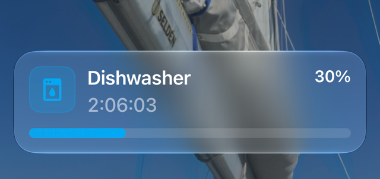

# Appliance Auto Notifier

[](https://github.com/rhizomatics/appliances_supernotifications/actions/workflows/ci.yml)

Automatic notifications for household appliances in Home Assistant, with no automations or YAML.



When a dishwasher, washing machine, oven or other appliance starts a cycle, you're told it started, your phone
shows a [Live Activity](https://companion.home-assistant.io/docs/notifications/live-activities) with progress
and time remaining while it runs, and you're told when it finishes.

This is an early version to try with real appliances. It supports Bosch, Neff and Siemens appliances connected
with the Home Assistant [Home Connect](https://www.home-assistant.io/integrations/home_connect/) integration,
in English only. Any other appliance can be added by hand if it has a power monitor, such as a smart plug.

## What You Need

- Home Assistant 2026.7 or later
- An appliance set up with the Home Connect integration, or one with a power sensor
- [Supernotify](https://supernotify.rhizomatics.org.uk), installed from HACS, for Live Activities and for anything
  beyond a plain notification
- Home Assistant app installed on an Apple mobile device, minimum iOS/iPadOS 17.2

Without Supernotify, it only sends a start and an end notification, to every phone with the Home Assistant app
unless you choose other notify entities.

## Install

[](https://my.home-assistant.io/redirect/hacs_repository/?owner=rhizomatics&repository=appliances_supernotifications&category=integration)

1. Use the button above, or in HACS add `https://github.com/rhizomatics/appliances_supernotifications` as a custom
   repository of type *Integration*, then install *Appliance Auto Notifier* and restart Home Assistant
2. In *Settings*, *Devices & services*, choose *Add integration* and pick *Appliance Auto Notifier*
3. Leave *Set up appliances automatically* on, and submit

That's all. Every Home Connect appliance is set up straight away, and so is any you add later. Each is listed on
the integration's page, alongside *Automatic discovery*, and notifies with no further settings.

To stop the notifications for an appliance, disable it rather than delete it, since a deleted appliance is found
and set up again.

### Choosing Appliances Yourself

Turn *Set up appliances automatically* off, on the first screen or later from the settings of *Automatic discovery*,
and appliances are instead offered as *Discovered* on the *Devices & services* page. Choose *Add* to set one up,
or *Ignore* on any you don't want.

### Power Monitored Appliances

An appliance with no supported integration can be added if a sensor measures the power it draws.

1. On the integration's page, choose *Add service*
2. Give the appliance a name, and choose its power sensor

| Setting         | Default    | What it does                                                                              |
| --------------- | ---------- | ----------------------------------------------------------------------------------------- |
| Power threshold | 1 W        | The appliance is running while it draws more than this                                    |
| Grace period    | 60 seconds | How long power must stay at or below the threshold before the cycle is over, so short drop outs are ignored |

Raise the grace period for appliances that pause mid-cycle, such as a washing machine soaking.

## Settings

Nothing needs changing for notifications to work. Each appliance on the integration's page has settings: *Notify
start* and *Notify end* switches, both on by default, for an oven a *Notify phases* switch, also on by default,
a *Notify progress* switch, off by default, with Supernotify
a *Dashboard to open* when a notification or the Live Activity is tapped, and then three sections that start closed.
With *Notify start* or *Notify end* off, that notification isn't sent, but the Live Activity is still opened and
closed, silently and on phones only. The dashboard is a choice of those in Home Assistant,
never a URL to type in, so a notification can't be made to open anything else.

| Section              | What it does                                                                                 |
| -------------------- | -------------------------------------------------------------------------------------------- |
| Start message        | The title and message sent when the appliance starts, shown as they'll be sent, such as "Dishwasher started". Clear a box to go back to the usual wording |
| End message          | The same for when it finishes, such as "Dishwasher is finished"                              |
| Notification targets | With Supernotify, *Targets* is the same choice of entities, devices, areas, floors and labels as any Supernotify notification, *Custom targets* is for those outside Home Assistant, such as e-mail addresses or phone numbers, and *Deliveries* limits notifications to those chosen. Leave them empty for Supernotify to choose. Without Supernotify, *Targets* is a choice of notify entities, and left empty means every phone with the Home Assistant app |

## What Gets Sent

| When                                   | With Supernotify                                                    | Without             |
| -------------------------------------- | ------------------------------------------------------------------- | ------------------- |
| Cycle starts                           | Start notification everywhere, opening a Live Activity on phones. With *Notify start* off, only the Live Activity, opened silently | Start notification, unless *Notify start* is off |
| Every 10% of progress                  | Silent update of the Live Activity, on phones only, with the program under way as its message, such as "Eco 50ºC". With *Notify progress* on, a notification everywhere instead, which updates the Live Activity too | Nothing, or with *Notify progress* on, a notification |
| Every 2% of progress, from 90%         | Silent update of the Live Activity, on phones only                  | Nothing             |
| Oven warming up                        | Silent update of the Live Activity as the oven warms, see below      | Nothing, or with *Notify progress* on, a notification |
| Oven up to heat                        | "Oven is pre-heated" everywhere, unless *Notify phases* is off       | The same notification, unless *Notify phases* is off |
| Cycle finishes                         | Live Activity closed, then an end notification everywhere, unless *Notify end* is off | End notification, unless *Notify end* is off |
| Cycle is aborted, or fails             | Live Activity closed, with no end notification                      | Nothing             |

Pausing and resuming an appliance counts as the same cycle. An appliance that is switched off, like an oven,
counts as finished.

### Oven Pre-heating

An oven with no timer set has no progress to report, so while it warms up, on any program, the bar is its
temperature as a percentage of the one it's set to, and the message is the two of them, such as "Pre-heating,
150 of 200°C", or "Fast pre-heat" in place of "Pre-heating" while that is on.

Once the oven is as hot as asked for, or reports that pre-heating is finished, "Oven is pre-heated" is sent
everywhere as a notification of its own, unless *Notify phases* is off. The Live Activity stays until the oven is
switched off, and goes straight on to the program and the temperature, such as "Pizza setting, 200°C", updated
whenever the temperature has moved by 5 degrees. From then on the oven isn't taken to be warming up again,
however its temperature wanders, until it has been off. With a timer set, the bar then goes on to the progress
of the program.

### Icons

The icon of a notification follows the type of appliance: dishwasher, washer, dryer, washer dryer, oven, hob, hood,
coffee maker, cleaning robot or air conditioner. A power monitored appliance has none to go by, so its name is
used instead, as in "Washer" or "Kettle".

## Known Limits

- Pre-heating is the only phase of a cycle there is to tell of, since Home Connect reports none for a dishwasher or washer, such as pre-wash or rinse

- If the appliance never reports the end of its cycle, the Live Activity stays on the phone until dismissed
- If Home Assistant restarts mid-cycle, the end is still notified and the Live Activity closed
- Progress, time remaining and the program are only shown where the appliance reports them, so never for a power monitored appliance
- If Home Assistant restarts while an oven is on, it isn't shown as pre-heating, since there's no knowing whether it has been up to heat, only with its program and temperature
- An oven with no timer set reports its progress as 100%, so that is what the bar shows once it's up to heat

## Known Issues

Both of these have been seen on an iPhone, and neither has a confirmed cause yet.

### Progress bar behind the appliance

The progress bar of the Live Activity can fall well behind, such as showing 40% while the appliance is at 74%.

The likely cause is iOS. Progress is sent with `silent: true`, so that the phone doesn't alert every 10%, and the
[Companion App](https://companion.home-assistant.io/docs/notifications/live-activities) sends silent updates at a
lower priority, which iOS may delay, batch or drop. This is a theory, since it hasn't been tested by sending the
updates without `silent`.

Turning on *Notify progress* sends each update as an ordinary notification, without `silent`, so is worth
trying if the bar matters more than the interruptions.

### Seconds shown as dashes

The time remaining sometimes has dashes in place of the seconds, such as `52:--` or `1:30:--`, on the Lock Screen
while the Dynamic Island shows a full countdown at the same moment.

The same finish time is sent however it ends up shown, and the Companion App has no setting for the format of the
timer, so this is down to the phone. The likely reason is that the Lock Screen is redrawn less often while it's
dimmed or always-on, so drops the seconds. This is also a theory, and nothing has been found that changes it.

## Development

```shell
uv sync
uv run pytest
uv run ruff check --fix && uv run ruff format
uv run mypy custom_components/appliance_auto_notifier
```
